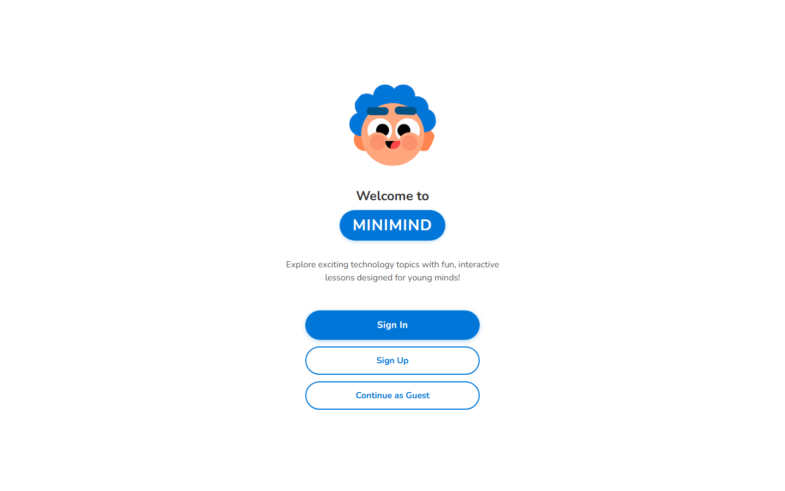
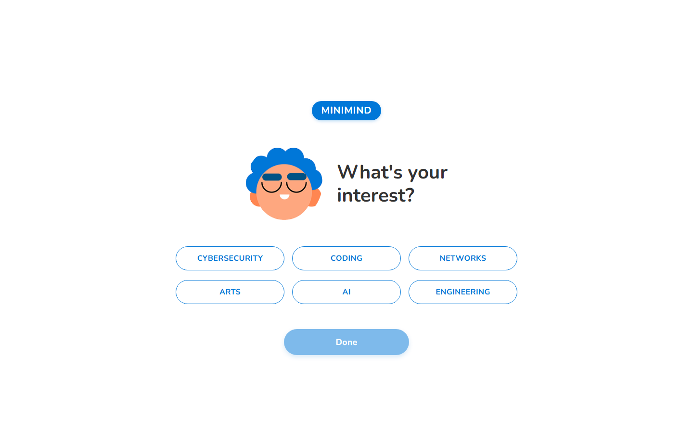
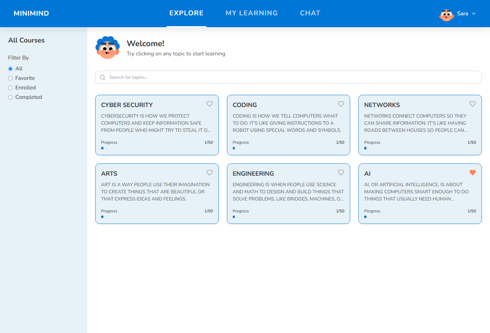
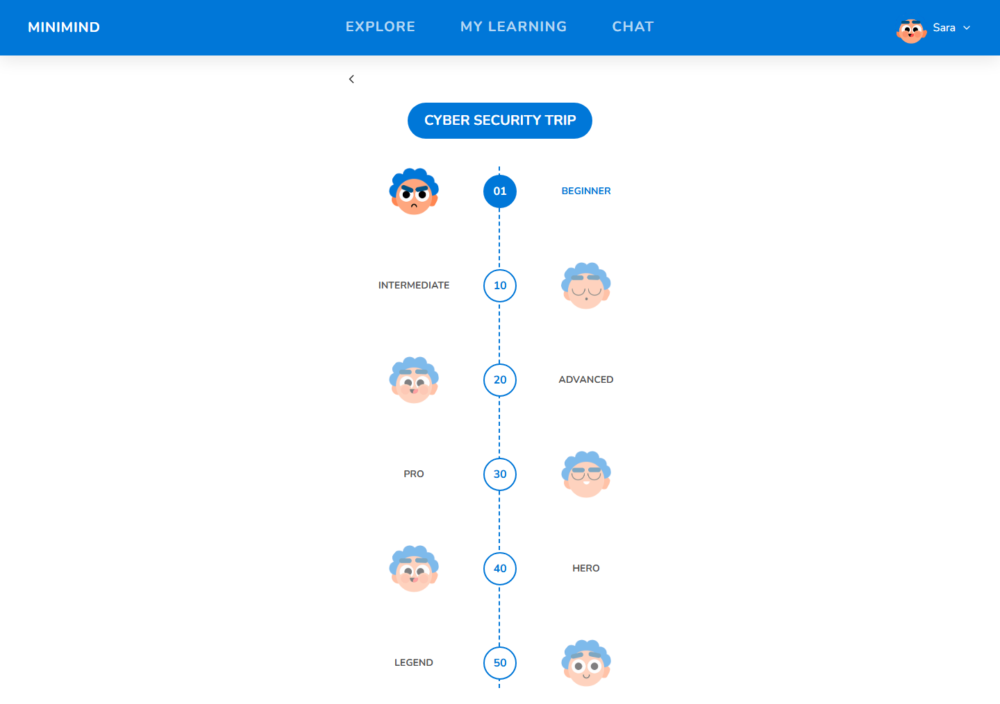

# MINIMIND

A learning app that introduces children to technology topics such as coding, networks, and AI through short topic cards, level paths, and a chat assistant.

Built as a team at the SolveThe17 hackathon, using React, TypeScript, Vite, and Tailwind CSS, with a small Express server for the chat assistant.



## Features

- **Welcome screen** with Sign In, Sign Up, and Continue as Guest
- **Onboarding** in two steps: the child enters a name, then picks one or more interests (Cybersecurity, Coding, Networks, Arts, AI, Engineering)
- **Explore page** with six topic cards. Topics that match the chosen interests are marked as favourites, and the list can be searched, filtered by All, Favorite, Enrolled, or Completed, and favourited with the heart icon
- **Topic pages** with a short child-friendly explanation and a "Did you know?" fact, plus a Let's Play button that opens the topic's level path
- **Level paths** from Beginner (01) to Legend (50), each level shown with a different avatar expression
- **My Learning page** with In Progress and Completed tabs and progress bars
- **Chat assistant** that sends the conversation to an OpenAI model through OpenRouter. It needs your own OpenRouter API key (see below)
- **Sign in and sign up forms** with validation. This is a demo: no account is stored and no password is checked, and the user is kept in memory only, so it is cleared on page reload

| Choosing interests | Explore | Level path |
|---|---|---|
|  |  |  |

## Run it

You need Node.js 18 or later and npm.

```bash
git clone https://github.com/nayra-ahmedaraby/SolveThe17-Hackathon.git
cd SolveThe17-Hackathon
npm install
```

To run only the front end:

```bash
npm run dev
```

Then open http://localhost:5173. Every page works without the server except the chat.

To use the chat assistant as well, create a `.env` file in the project root:

```
OPENROUTER_API_KEY=your-openrouter-key
```

Then start the server and the front end together:

```bash
npm run dev:all
```

### Scripts

| Command | What it does |
|---|---|
| `npm run dev` | Starts the Vite dev server on port 5173 |
| `npm run server` | Starts the Express server (`server.cjs`) on port 3001, or `PORT` if set |
| `npm run dev:all` | Runs both of the above with `concurrently` |
| `npm run build` | Builds the front end into `dist/` |
| `npm run preview` | Serves the production build locally |
| `npm run lint` | Runs ESLint |

## How it works

- **Routing.** `src/App.tsx` defines the routes with React Router: `/` and `/welcome`, `/onboarding`, `/signin`, `/signup`, `/explore`, `/course/:id`, `/path/:id`, `/my-learning`, and `/chat`. The top navigation bar is hidden on the welcome, onboarding, sign-in, and sign-up pages.
- **User state.** `src/context/AuthContext.tsx` holds the current user (name, email, interests) in React state. Onboarding saves the interests there, and the Explore and My Learning pages read them to mark favourites.
- **Content.** Topic descriptions, facts, and level paths are defined as data inside the page components. There is no database.
- **Chat.** The `/chat` page posts the message history to `/api/ai/ask`. Vite proxies `/api` to `http://localhost:3001`, where `server.cjs` forwards the request to the OpenRouter chat completions API using `openai/gpt-4o` and returns the reply. The API key stays on the server and is never sent to the browser.
- **Avatars.** `src/components/ui/Avatar.tsx` maps each expression (happy, angry, sleeping, and so on) to a face image in `public/asset/faces/`.
- **Animations** use Framer Motion, and icons come from Lucide React.

## Project structure

```
server.cjs              Express server that forwards chat requests to OpenRouter
index.html              Vite entry page
src/
  main.tsx              mounts the app inside BrowserRouter
  App.tsx               routes and layout
  context/
    AuthContext.tsx     in-memory user state (name, email, interests)
  pages/
    Welcome.tsx
    Onboarding.tsx      name and interest steps
    auth/SignIn.tsx
    auth/SignUp.tsx
    Explore.tsx         topic cards, search, and filters
    CourseDetail.tsx    topic explanation and fact
    LearningPath.tsx    levels 01 to 50
    MyLearning.tsx      in-progress and completed tabs
    Chat.tsx            styled chat page (not currently routed)
  components/
    ChatAssistant.tsx   chat component used by the /chat route
    layout/Header.tsx   top navigation bar
    ui/                 Avatar, Button, Card, Input, Logo
  types/index.ts        shared TypeScript types
public/
  asset/                design exports: faces, buttons, frames, text images
  logo-icon.svg
asset/                  copy of the design exports in public/asset
screenshots/            images used in this README
vite.config.ts          React plugin and /api proxy
tailwind.config.js      theme colours and fonts
```
